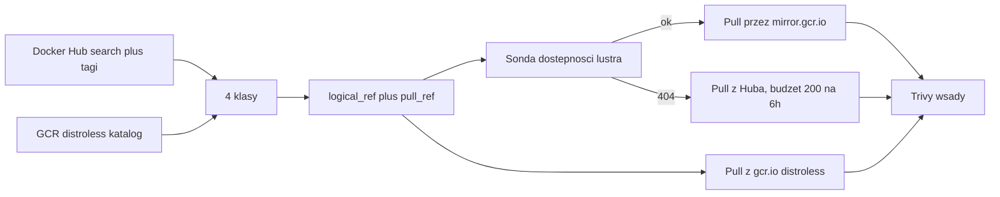

# Plan pracy inżynierskiej — analizator obrazów kontenerowych

Dokument odtworzony z rozmów z 21–23.08.2026 po zmianie nazwy katalogu projektu
(`C:\Projects\PRACA_IN\Code` → `C:\Projects\Container_Image_Anylyzer`), która odcięła historię
czatu. Źródłem są pliki planów `~/.cursor/plans/fetcher_matrycy_92879bdc.plan.md`
(wersja obowiązująca) oraz `~/.cursor/plans/inteligentny_fetcher_2bcd6835.plan.md`
(wcześniejsza, zastąpiona).

Rozdział [Rejestry i ścieżki pobierania](#rejestry-i-ścieżki-pobierania) oraz
[Warianty distroless](#warianty-distroless--dowody-pomiarowe) zawierają **korekty ustaleń
z 13.09.2026**, zweryfikowane empirycznie. Poprawiają one dwa błędy poprzednich planów.

## Dane oficjalne (APD)

- **Autor:** Kamil Wierzbicki, Wydział Informatyki i Telekomunikacji, Politechnika Wrocławska
- **Promotor:** mgr inż. Jakub Tomaszewski
- **Tytuł (PL):** Analiza porównawcza metod utwardzania środowisk kontenerowych pod kątem
  bezpieczeństwa i optymalizacji powierzchni ataku
- **Tytuł (EN):** Comparative analysis of container environment hardening methods for security
  and attack surface optimization
- **Cel:** kompleksowa analiza porównawcza skuteczności technik minimalizacji podatności
  (redukcja CVE i powierzchni ataku) oraz sformułowanie inżynierskich rekomendacji doboru
  baz systemowych.

Skaner jest **narzędziem badawczym**, nie produktem. Ciężar pracy leży w punktach 5–7.

### Zakres zatwierdzony

1. Wprowadzenie do aspektów bezpieczeństwa łańcucha dostaw i izolacji.
2. Przegląd narzędzi do skanowania i zdefiniowanie kryteriów doboru próby badawczej.
3. Zbudowanie systemu orkiestracji (pobieranie, skanowanie, parsowanie do analizy).
4. Zaprojektowanie i uruchomienie „matrycy testowej" (warianty o różnym stopniu utwardzenia).
5. Wielowymiarowa analiza statystyczna podatności (CVE, rozmiar, komponenty).
6. Porównanie wyników metod utwardzania (Slim, Alpine, Distroless vs Standard).
7. Wyciągnięcie wniosków (balans bezpieczeństwo vs funkcjonalność runtime).

### Literatura

1. Rice L., *Container Security*, O'Reilly 2020
2. Vehent J., *Securing DevOps*, Manning 2018
3. NIST SP 800-190, *Application Container Security Guide*
4. Google Cloud, *Distroless Container Images*
5. FIRST, *CVSS v3.1 Specification Guide*
6. *SLSA Framework* documentation

### Stos technologiczny

- **Architektura:** izolowane laboratorium w modelu Docker-out-of-Docker (DooD),
  mapowanie `/var/run/docker.sock`
- **Język:** Python — `requests`, `pandas`, `tqdm`, `subprocess`
- **Skaner:** Aqua Security Trivy (wyniki JSON)
- **Źródła:** API Docker Hub oraz Google Container Registry

## Rejestry i ścieżki pobierania

To rozdział najczęściej mylony. Trzy różne hosty, trzy różne role.

### Trzy hosty, trzy role

| Host | Czym jest | Rola w badaniu |
| --- | --- | --- |
| `registry-1.docker.io` (Docker Hub) | kanoniczne źródło obrazów oficjalnych `library/*` i społecznościowych | **źródło** klas `standard`, `slim`, `alpine` |
| `mirror.gcr.io` | pull-through cache **Docker Huba**, hostowany na Artifact Registry | **wyłącznie ścieżka pobierania** dla obrazów z Huba |
| `gcr.io/distroless` | kanoniczny dom obrazów distroless Google | **źródło** klasy `distroless` |

**`mirror.gcr.io` to lustro Docker Huba, nie lustro distroless.** To jego jedyne przeznaczenie.
Nie zawiera obrazów distroless. `gcr.io/distroless` nie jest lustrem czegokolwiek — to
oryginalne, kanoniczne miejsce publikacji obrazów distroless.

Weryfikacja (13.09.2026):

```
mirror.gcr.io/v2/distroless/python3-debian12/manifests/latest  -> 404
gcr.io/v2/distroless/python3-debian12/manifests/latest         -> 200
```

`404` na lustrze jest dowodem rozdzielności: lustro widzi tylko Docker Huba.

### „Czy GCR nie zostało wyłączone?" — odpowiedź na obronę

Pytanie prawdopodobne na obronie, więc warto mieć gotową odpowiedź z cytatami. Mylone są
**usługa** i **domena**:

- **Wyłączona została usługa Container Registry** — z dniem 18.03.2025 nie da się już
  *zapisywać* obrazów do Container Registry, a stara infrastruktura składowania (kubełki Cloud
  Storage) jest wygaszona.
- **Domena `gcr.io` działa dalej**, obsługiwana teraz przez Artifact Registry. Dokumentacja
  Google stwierdza wprost: *„`gcr.io` URLs hosted on Artifact Registry, including Google-owned
  images with `gcr.io` URLs, are **not affected** by the Container Registry shutdown."*

Projekt distroless **celowo pozostaje na `gcr.io`**. Jego README zawiera osobny wpis FAQ
dokładnie na to pytanie:

> *Why is distroless still using `gcr.io` instead of `pkg.dev`? Distroless's serving
> infrastructure has moved to artifact registry but we still use the `gcr.io` domain. Users will
> get the benefits of the newer infrastructure without changing their builds.*

W wątku migracyjnym `GoogleContainerTools/distroless#1630` utrzymujący dodają: *„`gcr.io/distroless`
is now served by the AR infrastructure. The GCR infra is shutting down but the domain `gcr.io`
will continue to be served by AR"*, oraz że referencje obrazów pozostają bez zmian
i **uwierzytelnianie nie jest wymagane** do pobierania.

**Nie „modernizować" adresów na `pkg.dev`.** `pkg.dev/distroless/...` nie działa (wymaga
uwierzytelnienia i innej struktury ścieżek) — jedyną poprawną formą jest `gcr.io/distroless/...`.

Weryfikacja dostępności (13.09.2026) — wszystkie 12 repozytoriów bieżącej linii `debian13`
odpowiadają `200` bez uwierzytelniania:

```
static-debian13     200     java17-debian13     200     nodejs22-debian13   200
base-debian13       200     java21-debian13     200     nodejs24-debian13   200
base-nossl-debian13 200     java25-debian13     200     nodejs26-debian13   200
cc-debian13         200     java-base-debian13  200     python3-debian13    200
```

Linia `debian12` również pozostaje dostępna (`static`, `base`, `python3`, `nodejs22`, `java21`,
`cc` — wszystkie `200`), co daje starsze obserwacje bez dodatkowego ryzyka. Projekt jest aktywnie
utrzymywany (bieżące PR-y podbijające wersje pakietów, wrzesień 2026); harmonogramy wsparcia
poszczególnych linii są w `SUPPORT_POLICY.md` w repozytorium upstream — to źródło kryterium
„która wersja jest wspierana" do rozdz. 2.

**Zabezpieczenie metodologiczne niezależne od losu rejestru.** Praca jest pomiarem
punktu w czasie. Każdy obraz w matrycy jest pinowany digestem i datą pobrania (zgodnie z SLSA),
więc wynik pozostaje cytowalny i weryfikowalny nawet gdyby adresy kiedyś się zmieniły. Ryzyko
rejestru nie jest ryzykiem trafności wyników.

### Discovery vs pull — rozdzielenie, które trzeba utrzymać

Obrazy w badaniu pochodzą **zawsze z dwóch źródeł równolegle**: Docker Hub daje
`standard` / `slim` / `alpine`, GCR daje `distroless`. Lustro nie zmienia składu próby — jest
wyłącznie szczegółem transportowym mówiącym, skąd Trivy ściąga warstwy.

- `logical_ref` — obraz, który opisujesz w pracy (`python:3.11-slim`)
- `pull_ref` — skąd faktycznie lecą warstwy (`mirror.gcr.io/library/python:3.11-slim`)
- `registry` — `hub` / `gcr` / `mirror`

Zmiana `pull_ref` nigdy nie zmienia `logical_ref`. Ten sam obraz logiczny nie może wejść do
matrycy dwa razy (Hub + lustro = 1 wiersz).

### Dwa różne limity — nie mylić w pracy

| Limit | Czego dotyczy | Obejście |
| --- | --- | --- |
| API listowania | search, endpoint tagów; Hub zwraca `429` | cache + backoff + token PAT |
| Pull warstw | `docker pull` / Trivy; konto darmowe ok. **200 pulli / 6 h** | lustro `mirror.gcr.io` |

Przy 10 tys. skanów sam Hub to ~12,5 doby. Dokumentacja Google potwierdza, że pobrania przez
`mirror.gcr.io` **nie są liczone do limitu Docker Huba**. Lustro jest więc **częścią metodyki**,
nie optymalizacją „na później".

Wyłączenie Container Registry (18.03.2025) **nie dotyczy** ani `mirror.gcr.io`, ani obrazów
Google z adresami `gcr.io` — jedno i drugie działa dalej na Artifact Registry.

### Pokrycie lustra — szersze niż zakładał poprzedni plan, ale z dziurami

Poprzedni plan twierdził, że lustro obejmuje tylko `library/*` i ostrzegał „nie udawaj, że
`mirror.gcr.io` ma cały Hub". Pomiar (13.09.2026) pokazuje, że **przestrzenie nieoficjalne też
działają**:

```
mirror.gcr.io/bitnami/nginx      -> 200      mirror.gcr.io/library/nginx     -> 200
mirror.gcr.io/grafana/grafana    -> 200      mirror.gcr.io/library/postgres  -> 200
mirror.gcr.io/prom/prometheus    -> 200      mirror.gcr.io/library/redis     -> 200
mirror.gcr.io/jenkins/jenkins    -> 200      mirror.gcr.io/library/memcached -> 200
                                             mirror.gcr.io/library/traefik   -> 200
                                             mirror.gcr.io/library/caddy     -> 200
```

Stare, niszowe tagi również są dostępne, co przeczy obawie, że cache trzyma tylko obrazy
„frequently requested":

```
mirror.gcr.io/library/python:3.13-slim          -> 200
mirror.gcr.io/library/python:3.10.21-alpine3.24 -> 200
```

**Ale są dziury, i jedna trafia prosto w plan.** `openjdk` — wskazany w poprzednim planie jako
jedno z dwóch dominujących repozytoriów (17 042 tagi) — jest **nieobecny na lustrze na poziomie
repozytorium**, nie pojedynczego tagu:

```
mirror.gcr.io/library/openjdk:latest   -> 404
mirror.gcr.io/library/openjdk:17       -> 404
mirror.gcr.io/library/openjdk:21       -> 404
mirror.gcr.io/library/openjdk:17-slim  -> 404
mirror.gcr.io/library/openjdk:24-jdk   -> 404
```

**Konsekwencja projektowa:** fetcher nie może stosować bezwarunkowej reguły przepisywania
`library/{name}` → `mirror.gcr.io/library/{name}`. Musi **sondować dostępność per repozytorium**
(`HEAD`/`GET` na manifest) i zapisywać wynik w matrycy, z jawnym fallbackiem na Hub. Obrazy
spadające na Hub obciążają licznik 200/6 h, więc muszą być budżetowane osobno.

Dodatkowo dokumentacja Google zaznacza, że obraz usunięty z Huba może pozostać w cache
**do kilku dni**. To kwestia trafności: teoretycznie można przeskanować obraz, którego już nie
ma w źródle. Do zapisania jako ograniczenie metodologiczne.

## Ustalenia zweryfikowane empirycznie

Fakty do zacytowania w rozdz. 2 (kryteria doboru próby):

- Populacja `library/` liczy dokładnie **180 repozytoriów** (`count=181` w search), więc da się
  ją wyliczyć wyczerpująco na 2 stronach po 100. Pierwotny `page_size=100` w `scanner.py`
  obcinał ją arbitralnie.
- API Docker Hub ma **odwróconą semantykę sortowania**: `ordering=pull_count` zwraca malejąco,
  `ordering=-pull_count` rosnąco. Nie polegamy na tym — sortujemy po stronie klienta.
- Populacja tagów to ~700 tys. (`openjdk` 17042, `node` 9036, `python` 3911). Deduplikacja
  redukuje ją o ~2/3 (100 tagów `python` = 33 unikalne obrazy).
- Endpoint tagów zwraca `full_size`, `digest`, `tag_last_pushed` oraz tablicę `images[]`
  z rozmiarem i digestem per architektura. **Wymiar „rozmiar" z pkt 5 dostajemy bez pobierania
  obrazów.**
- `gcr.io/distroless` zawiera tylko ~7 rodzin: `static`, `base`, `cc`, `java` (11/17/21/25),
  `nodejs` (14–26), `python3`, `dotnet` (przestarzały). Distroless dla `nginx`, `postgres`,
  `redis`, `mysql`, `php`, `ruby` **nie istnieje** — to ograniczenie metodologiczne do opisania
  w pracy, nie brak w kodzie.
- Każde repo distroless ma **4 stabilne aliasy**: `latest`, `debug`, `nonroot`, `debug-nonroot`.
  Pozostałe ~13 tys. tagów to identyfikatory commitów.
- Rozmiary referencyjne `python`: `3.10.21-alpine` ~20 MB, `3.10.21-slim` ~45 MB,
  `latest` ~415 MB.

## Warianty distroless — dowody pomiarowe

Poprzedni plan opisywał cztery aliasy jako **układ czynnikowy 2×2** (powłoka × użytkownik).
Pomiar manifestów `gcr.io/distroless/python3-debian12` (13.09.2026) pokazuje, że to
uproszczenie:

| Tag | Liczba warstw | Różnica względem `latest` |
| --- | --- | --- |
| `latest` | 43 | — (config `2352e7d5…`) |
| `nonroot` | 43 | **warstwy identyczne co do bajta**; różni się tylko config (`8dc1c27e…`) |
| `debug` | 44 | dokładnie **jedna dodatkowa warstwa, 740 164 B** (busybox); config `eca33119…` |
| `debug-nonroot` | 44 | warstwy identyczne z `debug`; różni się tylko config (`61f2d137…`) |

Cztery tagi to zatem **tylko dwa różne inwentarze pakietów**: `{latest, nonroot}` oraz
`{debug, debug-nonroot}`.

Odczyt configu potwierdza, że jedyną różnicą `latest` vs `nonroot` jest użytkownik:

```
python3-debian12:latest   ->  User = "0"
python3-debian12:nonroot  ->  User = "65532"
```

### Pułapka: distroless ma wyzerowane znaczniki czasu

Config obrazów distroless raportuje `created = 1970-01-01T00:00:00Z`. To celowy efekt budowania
reprodukowalnego (Bazel zeruje znaczniki czasu dla determinizmu), nie błąd rejestru.

**Konsekwencja:** pola `created` z configu **nie wolno** używać jako zmiennej „wiek obrazu" ani
jako kryterium świeżości — dla całej klasy `distroless` byłoby stałą równą epoce, co
systematycznie zaburzyłoby każdą analizę korelującą wiek z liczbą CVE. Wiek obrazów z Huba
bierzemy z `tag_last_pushed` z API, a dla distroless trzeba albo zrezygnować z tego wymiaru,
albo wziąć datę z metadanych rejestru (`timeUploaded`), nie z configu. Do zapisania jako
ograniczenie w rozdz. 5.

### Konsekwencja 1 — `latest` i `nonroot` dadzą identyczny wynik Trivy

Identyczne warstwy to identyczny inwentarz pakietów, czyli **identyczny zbiór CVE**. Trzymanie
obu jako pełnoprawnych wierszy matrycy podwaja liczebność distroless, nie wnosząc **żadnej**
nowej informacji o podatnościach.

`nonroot` jest wymiarem **utwardzania konfiguracji**, nie inwentarza pakietów. Ma realną
wartość jako realizacja zalecenia NIST SP 800-190 o nieuruchamianiu jako root — ale należy go
raportować jako **flagę boolowską przy obrazie**, a nie jako osobną obserwację w analizie CVE.

### Konsekwencja 2 — rezygnacja z `debug` kosztuje punkt 7

Decyzja o ograniczeniu się do obrazów zatwierdzonych (`latest`, `nonroot`) jest słuszna dla
punktu 6: warianty `debug` nie są rekomendowane produkcyjnie, więc nie reprezentują realnej
metody utwardzania.

Ale ta jedna warstwa 740 kB to **najczystszy eksperyment kontrolowany w całym zbiorze danych**:
identyczna baza, jedna zmienna, jedna warstwa. Jest to bezpośredni materiał dowodowy do punktu 7
(kiedy utwardzanie zaczyna przeszkadzać). Bez niego balans bezpieczeństwo–funkcjonalność trzeba
argumentować przez porównanie **różnych** baz, gdzie zmienia się kilkadziesiąt zmiennych naraz.

**Rekomendacja (do decyzji promotora):** `latest` + `nonroot` jako zatwierdzony zbiór
produkcyjny dla punktu 6, a `debug` zachowany jako **jawnie oznaczona grupa referencyjna
używana wyłącznie w punkcie 7**, wyłączona z głównego porównania. Koszt to ~12 dodatkowych
skanów, korzyść to najmocniejszy pojedynczy wynik pracy. Kolumna `role` w matrycy
(`production` / `reference`) rozdziela te dwa zastosowania bez mieszania ich we wnioskach.

### Konsekwencja 3 — błąd w regule deduplikacji

Poprzedni plan deduplikował **po digescie manifestu**. To nie zadziała: `latest` i `nonroot`
mają **różne digesty manifestu i identyczne warstwy**. Deduplikacja po digescie ich nie sklei,
więc N spuchnie o duplikaty profili CVE — dokładnie ta pseudoreplikacja, której plan miał
zapobiegać.

**Poprawka:** kluczem deduplikacji dla analizy CVE musi być **lista warstw** (albo `diff_ids`
z rootfs), nie digest manifestu. Digest manifestu zostaje jako identyfikator artefaktu do
cytowania w pracy (pinowanie zgodne z SLSA), ale nie jako klucz niezależności obserwacji.

## Taksonomia utwardzania

Wersja obowiązująca używa **czterech klas** z flagami jako osobnymi wymiarami:

- `standard` — pełny userland dystrybucji (`latest`, `3.13`, `3.13-trixie`)
- `slim` — `-slim`, `-slim-bookworm`; nadal `apt` i powłoka
- `alpine` — `-alpine`, `-alpine3.24`; musl libc, busybox, apk
- `distroless` — brak menedżera pakietów i powłoki

Czynniki ortogonalne, mierzone niezależnie od klasy:

- `nonroot` — flaga konfiguracyjna; **nie tworzy osobnej obserwacji CVE** (patrz Konsekwencja 1)
- `debug` — obecność busyboksa; tylko grupa referencyjna dla punktu 7 (patrz Konsekwencja 2)

> Wcześniejszy plan proponował skalę porządkową `H0`–`H4` (STANDARD / SLIM / ALPINE /
> DISTROLESS / STATIC) z `has_shell` i `nonroot` jako czynnikami ortogonalnymi. Został
> zastąpiony wariantem 4-klasowym. Jeśli wrócimy do pięciostopniowej skali, trzeba to
> rozstrzygnąć raz i zapisać, bo przesądza o kształcie analizy w pkt 5–6.

## Schemat matrycy testowej

| Kolumna | Znaczenie |
| --- | --- |
| `family` | technologia znormalizowana — czynnik grupujący w analizie |
| `variant` | klasa utwardzenia (`standard` / `slim` / `alpine` / `distroless`) |
| `logical_ref` | obraz opisywany w pracy |
| `pull_ref` | skąd Trivy ściąga warstwy |
| `registry` | `hub` / `gcr` / `mirror` |
| `mirror_ok` | czy lustro miało ten obraz (sondowane, nie zakładane) |
| `nonroot` | flaga konfiguracyjna |
| `role` | `production` / `reference` — rozdziela pkt 6 od pkt 7 |
| `layer_key` | klucz deduplikacji dla analizy CVE |
| `paired` | czy ta sama `family` ma ≥2 klasy |

### Przepływ danych



### Kwoty i niezależność obserwacji

- N łącznie ≈ 10 000 skanów; 25% dla klas rzadszych to aspiracja, nie twardy wymóg.
- Najpierw klasy rzadsze (GCR podnosi N distroless z ~50 w stronę setek — **nie** do 2500),
  reszta `standard`.
- Nierówny rozkład jest OK. Rozkład klas ma być **policzony, nie wymuszony**.
- Twardy limit ~150 obrazów na repozytorium plus alokacja proporcjonalna do
  `log(liczba_tagów)` — bez tego `openjdk` i `node` (26 tys. tagów łącznie) zdominowałyby próbę.
- Decyzja o tagach (`:latest` vs wszystkie wersje) — jedna reguła, zapisana. Wiele wersji tej
  samej bazy puchnie N i psuje niezależność obserwacji. Kolumna `family` służy jako czynnik
  grupujący, co zabezpiecza przed zarzutem, że N=10000 to nie 10 tys. niezależnych obserwacji.

### Uczciwy strop dla distroless

Katalog Distroless to **dziesiątki obrazów × kilka tagów**, nie 2500 niezależnych aplikacji.
Bieżąca linia `debian13` to 12 repozytoriów, wszystkie potwierdzone jako dostępne
(patrz [odpowiedź na obronę](#czy-gcr-nie-zostało-wyłączone--odpowiedź-na-obronę)):
`static`, `base`, `base-nossl`, `cc`, `java-base`, `java17`, `java21`, `java25`,
`nodejs22`, `nodejs24`, `nodejs26`, `python3`.

Przy zbiorze zatwierdzonym (`latest` + `nonroot`) to 12 obrazów × 2 tagi = **24 `image_ref`**,
ale wobec Konsekwencji 1 zaledwie **12 niezależnych profili CVE**. Linia `debian12` (również
dostępna) mniej więcej podwaja tę liczbę i daje dodatkowo wymiar „starsza vs nowsza baza
Debiana" — przy czym wersja bazy jest wtedy zmienną, więc obserwacje z `debian12` i `debian13`
nie są niezależne w obrębie tej samej technologii.

Sufiksy architektury (`amd64`, `arm64`, `arm`, `s390x`, `ppc64le`, `riscv64`) **nie** mnożą
wierszy — `latest` jest indeksem manifestów, więc bierzemy jedną architekturę (amd64) na skan.

Żeby N distroless urósł: albo dodajesz starsze linie debianowe jako osobne obserwacje, albo
dodajesz pokrewne korpusy (Chainguard / Wolfi) i piszesz w pracy „distroless-like", nie udając
że to ten sam Distroless Google.

## Mikro-kroki

Rola asystenta w tym planie: **drogowskaz**. Kod pisze student, commit po każdym kroku.

- [x] **Krok 0 — obserwacja (bez kodu).** Zamknięty: library `count=181`; search alpine
  `count=103978` + `next`; tagi python (alpine/slim/standard + rozmiary); allowlist Distroless
  z README.
- [ ] **Krok 1 — katalog Hub.** Kilka query, paginacja po `next`, dedup, `results/catalog.jsonl`.
  `feat(fetcher): paginowany katalog Hub z kilku zapytan`
- [ ] **Krok 2 — katalog GCR distroless.** Lista obrazów i dozwolonych tagów z README; API GCR
  tylko potwierdza istnienie. **Nie iterować całego `manifest`.** Filtr odrzuca: końcówki
  `.sig` / `.att`, prefix `update-available-`, tagi będące samym digestem / `sha256-...`.
  `feat(fetcher): enumeracja GCR distroless z filtrem tagow pomocniczych`
- [ ] **Krok 3 — tagi Hub + cache + backoff.** Token Hub tylko do API, **nie commitować**.
  `feat(fetcher): tagi Hub z cache i backoff przy 429`
- [ ] **Krok 4 — klasyfikacja + `pull_ref` + sonda lustra.** Dla każdego repo sprawdzić
  dostępność na `mirror.gcr.io` i zapisać `mirror_ok`; fallback na Hub z osobnym budżetem.
  **Nie** stosować bezwarunkowego przepisywania URL (patrz przypadek `openjdk`).
  `feat(fetcher): mapowanie pull_ref z sonda dostepnosci lustra`
- [ ] **Krok 5 — matryca 10 tys.** Merge Hub + GCR, dedup po `layer_key`, kwoty miękkie,
  `paired`, `role`.
  `feat(fetcher): matryca wielorejestrowa do 10 tys. skanow`
- [ ] **Krok 6 — skaner.** Trivy na `pull_ref`, partie poniżej limitu, resume gdy JSON raportu
  istnieje. Nie 10 tys. w jedną noc przez Hub.
  `feat(scanner): skan pull_ref z resume i limitem partii`

### Cel akceptacji

- Matryca zawiera kolumny z sekcji [Schemat matrycy testowej](#schemat-matrycy-testowej).
- Dwa kanały discovery: Hub + GCR distroless — **oba obowiązkowe**.
- Pull oficjalnych przez lustro tam, gdzie sonda potwierdziła dostępność; udział fallbacku na
  Hub policzony i zaraportowany.
- Trivy w partiach < 200 / 6 h na ścieżce Hub; ścieżki GCR i lustra liczone osobno.
- Rozkład klas policzony, nie wymuszony.
- Deduplikacja po `layer_key`, nie po digescie manifestu.

### Czego nie dodawać

Sztucznego doważania klas, crawla **całego** GCR (tylko projekt `distroless`), bazy danych,
UI, statystyk CVE na tym etapie, jednego przebiegu 10 tys. pulli przez Hub bez lustra.

## Dług techniczny w istniejącym kodzie

Zidentyfikowany przy rekonesansie, do domknięcia przy refaktoryzacji:

- `run_trivy_scan` nie ma `timeout`, a jego wartość zwracana jest ignorowana w `main()` — stąd
  75 raportów zamiast 100 zadanych, czyli ~25 **cichych porażek**.
- Klient HTTP ma `timeout=10` i gołe `except Exception` zwracające `None`, po czym `main()`
  wywołuje `len(images)` i wysypuje się na `None`. Docelowo: `HTTPAdapter` z
  `urllib3.Retry(total=5, backoff_factor=1.5, status_forcelist=[429,500,502,503,504],
  respect_retry_after_header=True)` i rozdzielne timeouty `(connect=10, read=30)`.
- `create_summary_report` buduje DataFrame z listy wszystkich rekordów naraz. 75 obrazów dało
  39,5 tys. wierszy, więc 10 tys. obrazów da ~5 mln wierszy i wyczerpie RAM. Potrzebny zapis
  przyrostowy do Parquet.
- Skan musi używać `--list-all-pkgs`, co da liczbę pakietów oraz wykrycie
  `bash`/`busybox`/`apt`/`apk` — to metryka funkcjonalności do pkt 7.
- `Dockerfile` nie zawiera `COPY scanner.py .` — kod działa wyłącznie z montowania.
- `requirements.txt` bez przypiętych wersji; do przypięcia wszystkie, do dołożenia `pyarrow`.

### Rozmiar danych i dysk

Przy 10 tys. obrazów: ~15–20 GB surowego JSON-a (obecnie 75 raportów = ~130 MB, sam
`report_iojs.json` ma 12 MB). Dysk w chwili planowania: C: 178 GB wolnego, D: 715 GB;
`reports/` 115 MB, `trivy_cache/` 2,3 GB.

Alternatywa dla DooD: Trivy z `--image-src remote` sięga po warstwy prosto do rejestru i trzyma
tylko wynik w cache fanal — wolumen `/var/run/docker.sock` przestaje być potrzebny do
skanowania. Architekturę DooD zostawiamy opisaną w pracy jako model izolacji laboratorium.

## Stan repozytorium

Jedyny commit merytoryczny to `dee4fa8 inital commit with PoC`. Implementacja fetchera z 21.08
**nie została zacommitowana, a pliki `.py` zniknęły** przy przenoszeniu katalogu. W `src/`
zostało wyłącznie skompilowane bytecode (`__pycache__/*.cpython-314.pyc`), które paradoksalnie
było jedyną wersjonowaną częścią `src/`. Odzyskiwalne moduły: `config`, `taxonomy`, `store`,
`matrix`, `registry/{http,dockerhub,gcr}`; brak `cli.py` (nie ma nawet `.pyc`).

Decyzja: **nie odtwarzamy** kodu z bytecode'u — zaczynamy od Kroku 1 zgodnie z planem
mentorskim. Bytecode pozostaje w historii gita (commit `dee4fa8`), więc decyzja jest odwracalna.
`__pycache__/` i `*.py[cod]` są od teraz ignorowane, żeby przypadek „zacommitowane `.pyc`,
niezacommitowane `.py`" się nie powtórzył.

## Jak odtworzyć pomiary z tego dokumentu

Wszystkie liczby w sekcjach [Rejestry](#rejestry-i-ścieżki-pobierania) i
[Warianty distroless](#warianty-distroless--dowody-pomiarowe) są odtwarzalne bez pobierania
obrazów:

```bash
A='Accept: application/vnd.oci.image.index.v1+json,application/vnd.docker.distribution.manifest.list.v2+json'

# lustro nie zawiera distroless
curl -s -o /dev/null -w '%{http_code}\n' -H "$A" \
  https://mirror.gcr.io/v2/distroless/python3-debian12/manifests/latest   # 404
curl -s -o /dev/null -w '%{http_code}\n' -H "$A" \
  https://gcr.io/v2/distroless/python3-debian12/manifests/latest          # 200

# dziura w pokryciu lustra
curl -s -o /dev/null -w '%{http_code}\n' -H "$A" \
  https://mirror.gcr.io/v2/library/openjdk/manifests/17                   # 404

# gcr.io/distroless dziala bez uwierzytelniania (biezaca linia debian13)
for r in static base base-nossl cc java-base java17 java21 java25 \
         nodejs22 nodejs24 nodejs26 python3; do
  printf '%-20s ' "$r-debian13"
  curl -s -o /dev/null -w '%{http_code}\n' -H "$A" \
    "https://gcr.io/v2/distroless/$r-debian13/manifests/latest"           # 200
done

# warstwy wariantow distroless (latest vs nonroot vs debug)
for t in latest nonroot debug debug-nonroot; do
  curl -s -H "$A" "https://gcr.io/v2/distroless/python3-debian12/manifests/$t"
done
```
