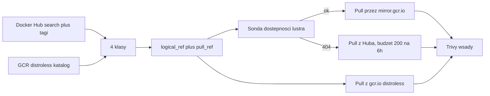

# Plan pracy inżynierskiej — analizator obrazów kontenerowych

Dokument odtworzony z rozmów z 21–23.08.2026 po zmianie nazwy katalogu projektu
(`C:\Projects\PRACA_IN\Code` → `C:\Projects\Container_Image_Anylyzer`), która odcięła historię
czatu. Źródłem są pliki planów `~/.cursor/plans/fetcher_matrycy_92879bdc.plan.md`
(wersja obowiązująca) oraz `~/.cursor/plans/inteligentny_fetcher_2bcd6835.plan.md`
(wcześniejsza, zastąpiona).

Rozdział [Rejestry i ścieżki pobierania](#rejestry-i-ścieżki-pobierania) oraz
[Warianty distroless](#warianty-distroless--dowody-pomiarowe) zawierają **korekty ustaleń
z 13.09.2026**, zweryfikowane empirycznie. Poprawiają one dwa błędy poprzednich planów.

## Dane oficjalne (APD)

- **Autor:** Kamil Wierzbicki, Wydział Informatyki i Telekomunikacji, Politechnika Wrocławska
- **Promotor:** mgr inż. Jakub Tomaszewski
- **Tytuł (PL):** Analiza porównawcza metod utwardzania środowisk kontenerowych pod kątem
  bezpieczeństwa i optymalizacji powierzchni ataku
- **Tytuł (EN):** Comparative analysis of container environment hardening methods for security
  and attack surface optimization
- **Cel:** kompleksowa analiza porównawcza skuteczności technik minimalizacji podatności
  (redukcja CVE i powierzchni ataku) oraz sformułowanie inżynierskich rekomendacji doboru
  baz systemowych.

Skaner jest **narzędziem badawczym**, nie produktem. Ciężar pracy leży w punktach 5–7.

### Zakres zatwierdzony

1. Wprowadzenie do aspektów bezpieczeństwa łańcucha dostaw i izolacji.
2. Przegląd narzędzi do skanowania i zdefiniowanie kryteriów doboru próby badawczej.
3. Zbudowanie systemu orkiestracji (pobieranie, skanowanie, parsowanie do analizy).
4. Zaprojektowanie i uruchomienie „matrycy testowej" (warianty o różnym stopniu utwardzenia).
5. Wielowymiarowa analiza statystyczna podatności (CVE, rozmiar, komponenty).
6. Porównanie wyników metod utwardzania (Slim, Alpine, Distroless vs Standard).
7. Wyciągnięcie wniosków (balans bezpieczeństwo vs funkcjonalność runtime).

### Jak zakres APD ma się do kroków implementacji

Częste zamieszanie: „Kroki 0–6" z rozdziału [Mikro-kroki](#mikro-kroki) **nie są** alternatywnym
planem pracy. To rozpisanie na zadania programistyczne **wyłącznie punktów 3 i 4** zatwierdzonego
zakresu. Pozostałe punkty albo poprzedzają kod, albo następują po nim.

| Punkt APD | Czym jest | Kroki kodu |
| --- | --- | --- |
| 1. Wprowadzenie, łańcuch dostaw, izolacja | tekst, literatura | brak — pisanie |
| 2. Przegląd narzędzi, kryteria doboru próby | tekst oparty na pomiarach | dane z Kroku 0 i 1 |
| 3. System orkiestracji | **kod** | Kroki 1, 2, 3, 6 |
| 4. Projekt i uruchomienie matrycy | **kod** | Kroki 4, 5 |
| 5. Analiza statystyczna | praca na wynikach | brak — po Kroku 6 |
| 6. Porównanie metod utwardzania | praca na wynikach | brak — po Kroku 6 |
| 7. Wnioski, balans bezpieczeństwo/funkcjonalność | praca na wynikach | brak — po Kroku 6 |

Wniosek, który warto mieć z tyłu głowy przy planowaniu czasu: **kroki kodu kończą się tam, gdzie
zaczyna się właściwy ciężar pracy**. Krok 6 produkuje tabelę z liczbami, a punkty 5–7 dopiero
z niej powstają. Rozbudowywanie skanera ponad to, czego wymaga matryca, nie przybliża do obrony.

### Literatura

1. Rice L., *Container Security*, O'Reilly 2020
2. Vehent J., *Securing DevOps*, Manning 2018
3. NIST SP 800-190, *Application Container Security Guide*
4. Google Cloud, *Distroless Container Images*
5. FIRST, *CVSS v3.1 Specification Guide*
6. *SLSA Framework* documentation

### Stos technologiczny

- **Architektura:** narzędzia (Trivy, Python, zależności) zamknięte w kontenerze, żeby nie
  instalować ich na maszynie hosta. Pierwotnie w modelu Docker-out-of-Docker z mapowaniem
  `/var/run/docker.sock`; przy `--image-src remote` montowanie gniazda przestaje być potrzebne —
  patrz [Kontener orkiestrujący](#kontener-orkiestrujący-po-co-był-dood-i-co-z-niego-zostaje)
- **Język:** Python — `requests`, `pandas`, `tqdm`, `subprocess`
- **Skaner:** Aqua Security Trivy (wyniki JSON)
- **Źródła:** API Docker Hub oraz Google Container Registry

## Rejestry i ścieżki pobierania

To rozdział najczęściej mylony. Trzy różne hosty, trzy różne role.

### Trzy hosty, trzy role

| Host | Czym jest | Rola w badaniu |
| --- | --- | --- |
| `registry-1.docker.io` (Docker Hub) | kanoniczne źródło obrazów oficjalnych `library/*` i społecznościowych | **źródło** klas `standard`, `slim`, `alpine` |
| `mirror.gcr.io` | pull-through cache **Docker Huba**, hostowany na Artifact Registry | **wyłącznie ścieżka pobierania** dla obrazów z Huba |
| `gcr.io/distroless` | kanoniczny dom obrazów distroless Google | **źródło** klasy `distroless` |

**`mirror.gcr.io` to lustro Docker Huba, nie lustro distroless.** To jego jedyne przeznaczenie.
Nie zawiera obrazów distroless. `gcr.io/distroless` nie jest lustrem czegokolwiek — to
oryginalne, kanoniczne miejsce publikacji obrazów distroless.

Weryfikacja (13.09.2026):

```
mirror.gcr.io/v2/distroless/python3-debian12/manifests/latest  -> 404
gcr.io/v2/distroless/python3-debian12/manifests/latest         -> 200
```

`404` na lustrze jest dowodem rozdzielności: lustro widzi tylko Docker Huba.

### „Czy GCR nie zostało wyłączone?" — odpowiedź na obronę

Pytanie prawdopodobne na obronie, więc warto mieć gotową odpowiedź z cytatami. Mylone są
**usługa** i **domena**:

- **Wyłączona została usługa Container Registry** — z dniem 18.03.2025 nie da się już
  *zapisywać* obrazów do Container Registry, a stara infrastruktura składowania (kubełki Cloud
  Storage) jest wygaszona.
- **Domena `gcr.io` działa dalej**, obsługiwana teraz przez Artifact Registry. Dokumentacja
  Google stwierdza wprost: *„`gcr.io` URLs hosted on Artifact Registry, including Google-owned
  images with `gcr.io` URLs, are **not affected** by the Container Registry shutdown."*

Projekt distroless **celowo pozostaje na `gcr.io`**. Jego README zawiera osobny wpis FAQ
dokładnie na to pytanie:

> *Why is distroless still using `gcr.io` instead of `pkg.dev`? Distroless's serving
> infrastructure has moved to artifact registry but we still use the `gcr.io` domain. Users will
> get the benefits of the newer infrastructure without changing their builds.*

W wątku migracyjnym `GoogleContainerTools/distroless#1630` utrzymujący dodają: *„`gcr.io/distroless`
is now served by the AR infrastructure. The GCR infra is shutting down but the domain `gcr.io`
will continue to be served by AR"*, oraz że referencje obrazów pozostają bez zmian
i **uwierzytelnianie nie jest wymagane** do pobierania.

**Nie „modernizować" adresów na `pkg.dev`.** `pkg.dev/distroless/...` nie działa (wymaga
uwierzytelnienia i innej struktury ścieżek) — jedyną poprawną formą jest `gcr.io/distroless/...`.

Weryfikacja dostępności (13.09.2026) — wszystkie 12 repozytoriów bieżącej linii `debian13`
odpowiadają `200` bez uwierzytelniania:

```
static-debian13     200     java17-debian13     200     nodejs22-debian13   200
base-debian13       200     java21-debian13     200     nodejs24-debian13   200
base-nossl-debian13 200     java25-debian13     200     nodejs26-debian13   200
cc-debian13         200     java-base-debian13  200     python3-debian13    200
```

Linia `debian12` również pozostaje dostępna (`static`, `base`, `python3`, `nodejs22`, `java21`,
`cc` — wszystkie `200`), co daje starsze obserwacje bez dodatkowego ryzyka. Projekt jest aktywnie
utrzymywany (bieżące PR-y podbijające wersje pakietów, wrzesień 2026); harmonogramy wsparcia
poszczególnych linii są w `SUPPORT_POLICY.md` w repozytorium upstream — to źródło kryterium
„która wersja jest wspierana" do rozdz. 2.

**Zabezpieczenie metodologiczne niezależne od losu rejestru.** Praca jest pomiarem
punktu w czasie. Każdy obraz w matrycy jest pinowany digestem i datą pobrania (zgodnie z SLSA),
więc wynik pozostaje cytowalny i weryfikowalny nawet gdyby adresy kiedyś się zmieniły. Ryzyko
rejestru nie jest ryzykiem trafności wyników.

### Discovery vs pull — rozdzielenie, które trzeba utrzymać

Obrazy w badaniu pochodzą **zawsze z dwóch źródeł równolegle**: Docker Hub daje
`standard` / `slim` / `alpine`, GCR daje `distroless`. Lustro nie zmienia składu próby — jest
wyłącznie szczegółem transportowym mówiącym, skąd Trivy ściąga warstwy.

- `logical_ref` — obraz, który opisujesz w pracy (`python:3.11-slim`)
- `pull_ref` — skąd faktycznie lecą warstwy (`mirror.gcr.io/library/python:3.11-slim`)
- `registry` — `hub` / `gcr` / `mirror`

Zmiana `pull_ref` nigdy nie zmienia `logical_ref`. Ten sam obraz logiczny nie może wejść do
matrycy dwa razy (Hub + lustro = 1 wiersz).

### Trzy różne limity — nie mylić w pracy

| Limit | Czego dotyczy | Obejście |
| --- | --- | --- |
| API listowania | search, endpoint tagów; Hub zwraca `429` | cache + backoff + token PAT |
| **Offset paginacji** | **głębokość stronicowania dla żądań anonimowych; Hub zwraca `403`** | **token PAT; dla `library/` trik z `ordering`** |
| Pull warstw | `docker pull` / Trivy; konto darmowe ok. **200 pulli / 6 h** | lustro `mirror.gcr.io` |

#### Limit offsetu — odkryty 18.09.2026, zmienia wykonalność Kroku 3

Hub odmawia anonimowego stronicowania poniżej pewnej głębokości, zwracając `403` z treścią:

```
{"message":"pagination offset too large for anonymous requests; sign in to page further"}
```

Limit dotyczy **offsetu**, nie numeru strony (`page=2&page_size=50` przechodzi, `page=2&page_size=100`
już nie), i jest **różny dla różnych endpointów**. Zmierzone progi:

| Endpoint | Ostatni działający offset | Pierwszy zablokowany |
| --- | --- | --- |
| `/v2/repositories/library/` | 90 | 100 |
| `/v2/search/repositories/` | 100 | 200 |
| `/v2/repositories/{ns}/{name}/tags/` | 900 | 3900 |

Sprawdzone: zjawisko **nie zależy** od `User-Agent` ani od biblioteki klienckiej (identyczne
wyniki dla `requests` i `urllib`, dla nagłówka własnego i przeglądarkowego), więc nie jest to
wykrywanie bota, tylko celowa polityka API.

**Obejście dla `library/` bez tokenu.** Repozytoriów jest 181, a anonimowo widać najwyżej
pierwszą setkę. Dwa żądania z przeciwnych końców sortowania pokrywają jednak cały zbiór —
`ordering=pull_count` (malejąco) plus `ordering=-pull_count` (rosnąco) dają część wspólną
19 pozycji i sumę **dokładnie 181**, zgodną z deklarowanym `count`. Odwrócona semantyka
`ordering` przestaje więc być ciekawostką, a staje się narzędziem.

**Konsekwencja dla Kroku 3: token PAT jest wymagany, nie opcjonalny.** Tagów `python` jest
3923, czyli powyżej progu 3900 — ostatnia strona odpadnie. Dla `openjdk` (17 042 tagi)
anonimowo zobaczymy kilka procent zbioru, co uniemożliwiłoby deduplikację i dobór próby.

Przy 10 tys. skanów sam Hub to ~12,5 doby. Dokumentacja Google potwierdza, że pobrania przez
`mirror.gcr.io` **nie są liczone do limitu Docker Huba**. Lustro jest więc **częścią metodyki**,
nie optymalizacją „na później".

Wyłączenie Container Registry (18.03.2025) **nie dotyczy** ani `mirror.gcr.io`, ani obrazów
Google z adresami `gcr.io` — jedno i drugie działa dalej na Artifact Registry.

### Pokrycie lustra — szersze niż zakładał poprzedni plan, ale z dziurami

Poprzedni plan twierdził, że lustro obejmuje tylko `library/*` i ostrzegał „nie udawaj, że
`mirror.gcr.io` ma cały Hub". Pomiar (13.09.2026) pokazuje, że **przestrzenie nieoficjalne też
działają**:

```
mirror.gcr.io/bitnami/nginx      -> 200      mirror.gcr.io/library/nginx     -> 200
mirror.gcr.io/grafana/grafana    -> 200      mirror.gcr.io/library/postgres  -> 200
mirror.gcr.io/prom/prometheus    -> 200      mirror.gcr.io/library/redis     -> 200
mirror.gcr.io/jenkins/jenkins    -> 200      mirror.gcr.io/library/memcached -> 200
                                             mirror.gcr.io/library/traefik   -> 200
                                             mirror.gcr.io/library/caddy     -> 200
```

Stare, niszowe tagi również są dostępne, co przeczy obawie, że cache trzyma tylko obrazy
„frequently requested":

```
mirror.gcr.io/library/python:3.13-slim          -> 200
mirror.gcr.io/library/python:3.10.21-alpine3.24 -> 200
```

**Ale są dziury, i jedna trafia prosto w plan.** `openjdk` — wskazany w poprzednim planie jako
jedno z dwóch dominujących repozytoriów (17 042 tagi) — jest **nieobecny na lustrze na poziomie
repozytorium**, nie pojedynczego tagu:

```
mirror.gcr.io/library/openjdk:latest   -> 404
mirror.gcr.io/library/openjdk:17       -> 404
mirror.gcr.io/library/openjdk:21       -> 404
mirror.gcr.io/library/openjdk:17-slim  -> 404
mirror.gcr.io/library/openjdk:24-jdk   -> 404
```

**Konsekwencja projektowa:** fetcher nie może stosować bezwarunkowej reguły przepisywania
`library/{name}` → `mirror.gcr.io/library/{name}`. Musi **sondować dostępność per repozytorium**
(`HEAD`/`GET` na manifest) i zapisywać wynik w matrycy, z jawnym fallbackiem na Hub. Obrazy
spadające na Hub obciążają licznik 200/6 h, więc muszą być budżetowane osobno.

Dodatkowo dokumentacja Google zaznacza, że obraz usunięty z Huba może pozostać w cache
**do kilku dni**. To kwestia trafności: teoretycznie można przeskanować obraz, którego już nie
ma w źródle. Do zapisania jako ograniczenie metodologiczne.

## Ustalenia zweryfikowane empirycznie

Fakty do zacytowania w rozdz. 2 (kryteria doboru próby):

- Populacja `library/` liczy **181 repozytoriów** — tyle deklaruje `count` i tyle daje suma
  dwóch przebiegów po `ordering` (zweryfikowane 18.09.2026). Pierwotny `page_size=100`
  w `scanner.py` obcinał ją arbitralnie. Uwaga: zwykła paginacja **nie wystarczy**, bo
  anonimowy offset jest ograniczony — patrz [Limit offsetu](#limit-offsetu--odkryty-18092026-zmienia-wykonalność-kroku-3).
- `page_size` jest **po cichu ścinany do 100**. Przy `page_size=1000` Hub zwraca 100 rekordów,
  ale odsyła `page_size=1000` w polu `next`, więc nic nie sygnalizuje obcięcia. Nie wolno liczyć
  oczekiwanej liczby stron jako `count / page_size` z inną wartością.
- API Docker Hub ma **odwróconą semantykę sortowania**: `ordering=pull_count` zwraca malejąco,
  `ordering=-pull_count` rosnąco. Przy sortowaniu wyników polegamy na kliencie, ale sama
  dwukierunkowość jest wykorzystana celowo jako obejście limitu offsetu (patrz wyżej).
- **Dwa endpointy Kroku 1 mają prawie rozłączne pola.** Wspólne są tylko `pull_count`
  i `star_count`:

  | | `/repositories/library/` | `/search/repositories/` |
  | --- | --- | --- |
  | nazwa | `name` + `namespace` | `repo_name` (sklejone) |
  | opis | `description` | `short_description` |
  | data | `last_updated`, `date_registered` | **brak** |
  | oficjalność | brak (wszystko jest oficjalne) | `is_official` |
  | rozmiar | `storage_size` | brak |

  Konsekwencje: potrzebne są **dwie funkcje normalizujące** do wspólnego rekordu; `repo_name`
  wymaga rozbicia, bo oficjalne przychodzą jako `nginx`, a pozostałe jako `bitnami/nginx`
  (bez tego klucz deduplikacji się rozjeżdża i to samo repo wchodzi dwa razy); `last_updated`
  dla wyników z wyszukiwania zostaje puste i jest uzupełniane w Kroku 3.
- **Kolejność źródeł w Kroku 1 jest nośna.** Ponieważ rekord z `library/` jest bogatszy,
  przetwarzamy go **przed** wyszukiwaniem i pomijamy klucze już widziane. Dzięki temu nie
  trzeba pisać logiki scalania rekordów. Weryfikacja przebiegu z 18.09.2026: 1764 unikalne
  repozytoria, zero duplikatów, `last_updated` obecne w dokładnie 181 rekordach.
- Populacja tagów to ~700 tys. (`openjdk` 17042, `node` 9036, `python` 3911). Deduplikacja
  redukuje ją o ~2/3 (100 tagów `python` = 33 unikalne obrazy).
- Endpoint tagów zwraca `full_size`, `digest`, `tag_last_pushed` oraz tablicę `images[]`
  z rozmiarem i digestem per architektura. **Wymiar „rozmiar" z pkt 5 dostajemy bez pobierania
  obrazów.**
- `gcr.io/distroless` zawiera tylko ~7 rodzin: `static`, `base`, `cc`, `java` (11/17/21/25),
  `nodejs` (14–26), `python3`, `dotnet` (przestarzały). Distroless dla `nginx`, `postgres`,
  `redis`, `mysql`, `php`, `ruby` **nie istnieje** — to ograniczenie metodologiczne do opisania
  w pracy, nie brak w kodzie.
- Każde repo distroless ma **4 stabilne aliasy**: `latest`, `debug`, `nonroot`, `debug-nonroot`
  (pozostałe ~13 tys. tagów to identyfikatory commitów). Do badania bierzemy **wyłącznie
  `latest`** — patrz Konsekwencje 1 i 2.
- Rozmiary referencyjne `python`: `3.10.21-alpine` ~20 MB, `3.10.21-slim` ~45 MB,
  `latest` ~415 MB.

## Warianty distroless — dowody pomiarowe

Poprzedni plan opisywał cztery aliasy jako **układ czynnikowy 2×2** (powłoka × użytkownik).
Pomiar manifestów `gcr.io/distroless/python3-debian12` (13.09.2026) pokazuje, że to
uproszczenie:

| Tag | Liczba warstw | Różnica względem `latest` |
| --- | --- | --- |
| `latest` | 43 | — (config `2352e7d5…`) |
| `nonroot` | 43 | **warstwy identyczne co do bajta**; różni się tylko config (`8dc1c27e…`) |
| `debug` | 44 | dokładnie **jedna dodatkowa warstwa, 740 164 B** (busybox); config `eca33119…` |
| `debug-nonroot` | 44 | warstwy identyczne z `debug`; różni się tylko config (`61f2d137…`) |

Cztery tagi to zatem **tylko dwa różne inwentarze pakietów**: `{latest, nonroot}` oraz
`{debug, debug-nonroot}`.

Odczyt configu potwierdza, że jedyną różnicą `latest` vs `nonroot` jest użytkownik:

```
python3-debian12:latest   ->  User = "0"
python3-debian12:nonroot  ->  User = "65532"
```

### Pułapka: distroless ma wyzerowane znaczniki czasu

Config obrazów distroless raportuje `created = 1970-01-01T00:00:00Z`. To celowy efekt budowania
reprodukowalnego (Bazel zeruje znaczniki czasu dla determinizmu), nie błąd rejestru.

**Konsekwencja:** pola `created` z configu **nie wolno** używać jako zmiennej „wiek obrazu" ani
jako kryterium świeżości — dla całej klasy `distroless` byłoby stałą równą epoce, co
systematycznie zaburzyłoby każdą analizę korelującą wiek z liczbą CVE. Wiek obrazów z Huba
bierzemy z `tag_last_pushed` z API, a dla distroless trzeba albo zrezygnować z tego wymiaru,
albo wziąć datę z metadanych rejestru (`timeUploaded`), nie z configu. Do zapisania jako
ograniczenie w rozdz. 5.

### Konsekwencja 1 — skanujemy tylko `latest` (decyzja podjęta)

Identyczne warstwy to identyczny inwentarz pakietów, czyli **identyczny zbiór CVE**. Skanowanie
obu wariantów byłoby więc pobraniem tej samej informacji dwa razy.

**Decyzja:** z każdego repozytorium distroless bierzemy **wyłącznie tag `latest`** — jeden wiersz
matrycy na repozytorium. `nonroot` nie jest skanowany.

**Dlaczego `latest`, a nie `nonroot`.** Wybór nie jest dowolny, mimo że dla CVE oba są
równoważne. Obrazy z Huba w klasach `standard`, `slim` i `alpine` domyślnie działają jako root.
Gdybyśmy jako reprezentanta distroless wzięli `nonroot` (`User = "65532"`), do delty
`distroless − standard` wszedłby **dodatkowy czynnik: zmiana użytkownika**, którego pozostałe
klasy nie mają. `latest` ma `User = "0"`, czyli identycznie jak warianty z Huba, więc uprzywilejowanie
pozostaje **stałą w całym porównaniu** i delta mierzy wyłącznie różnice w userlandzie i zestawie
pakietów. To eliminuje confounder, którego inaczej trzeba by tłumaczyć w rozdz. 6.

**`nonroot` nadal jest treścią pracy — tylko nie obserwacją.** Jego właściwości są udowodnione
inspekcją manifestów, bez żadnego skanu: identyczne warstwy, `User = "0"` vs `User = "65532"`.
Wynika z tego wniosek wart osobnego akapitu w punkcie 7: **utwardzenie użytkownika jest w
distroless darmowe** — realizuje zalecenie NIST SP 800-190 o nieuruchamianiu jako root przy
zerowej zmianie liczby CVE i zerowej utracie funkcjonalności. To jedyny punkt w całym badaniu,
gdzie utwardzanie nic nie kosztuje, co dobrze kontrastuje z pozostałymi klasami, gdzie redukcja
CVE zawsze wiąże się z utratą możliwości runtime.

W matrycy odnotowujemy to kolumną `nonroot_available` (własność repozytorium), a nie osobnym
wierszem.

### Konsekwencja 2 — `debug` wyłączony ze zbioru (decyzja podjęta)

**Decyzja:** warianty `debug` i `debug-nonroot` **nie wchodzą do badania**. Nie są rekomendowane
produkcyjnie, więc nie reprezentują realnej metody utwardzania.

Łącznie z Konsekwencją 1 daje to jedną regułę dla całego GCR: **z czterech aliasów zostaje
wyłącznie `latest`**. Fetcher odfiltrowuje `debug`, `debug-nonroot` i `nonroot` już na etapie
enumeracji GCR (Krok 2), a nie dopiero w analizie.

Wiersze `debug` w tabeli powyżej zostają w dokumencie **wyłącznie jako dowód pomiarowy** — to
one pokazują, że aliasy distroless redukują się do dwóch inwentarzy pakietów, co uzasadnia
Konsekwencje 1 i 3. Nie są elementem próby.

Skutkiem jest brak kontrastu wewnątrz identycznej bazy, więc punkt 7 opiera się na innym
schemacie — patrz [Punkt 7: standard jako baseline](#punkt-7-standard-jako-baseline).

### Konsekwencja 3 — błąd w regule deduplikacji

Poprzedni plan deduplikował **po digescie manifestu**. Para `latest` / `nonroot` pokazuje, że to
niewystarczające: mają **różne digesty manifestu i identyczne warstwy**, więc deduplikacja po
digescie ich nie sklei i N spuchnie o duplikaty profili CVE — dokładnie ta pseudoreplikacja,
której plan miał zapobiegać.

W samym GCR problem znika przez decyzję z Konsekwencji 1 (bierzemy tylko `latest`), ale reguła
zostaje potrzebna **po stronie Huba**, gdzie skala jest znacznie większa: aliasy w rodzaju
`3.10-alpine`, `3.10.21-alpine` i `3.10.21-alpine3.24` wskazują ten sam obraz, a część tagów
różni się wyłącznie metadanymi.

**Poprawka:** kluczem deduplikacji dla analizy CVE musi być **lista warstw** (albo `diff_ids`
z rootfs), nie digest manifestu. Digest manifestu zostaje jako identyfikator artefaktu do
cytowania w pracy (pinowanie zgodne z SLSA), ale nie jako klucz niezależności obserwacji.

## Taksonomia utwardzania

Wersja obowiązująca używa **czterech klas** z flagami jako osobnymi wymiarami:

- `standard` — pełny userland dystrybucji (`latest`, `3.13`, `3.13-trixie`)
- `slim` — `-slim`, `-slim-bookworm`; nadal `apt` i powłoka
- `alpine` — `-alpine`, `-alpine3.24`; musl libc, busybox, apk
- `distroless` — brak menedżera pakietów i powłoki

Taksonomia nie ma czynników ortogonalnych — klasa jednoznacznie opisuje obraz. Uprzywilejowanie
jest **stałą całego badania** (wszystkie skanowane obrazy działają jako root, `User = "0"`), co
jest celowe: dzięki temu delty z punktu 7 nie są zanieczyszczone zmianą użytkownika
(patrz Konsekwencja 1).

Aliasy `debug`, `debug-nonroot` i `nonroot` są **odfiltrowywane na etapie pobierania** i nie mają
reprezentacji w taksonomii (Konsekwencje 1 i 2). Dostępność wariantu `nonroot` jest zapisywana
jako `nonroot_available` i omawiana jakościowo, bez skanu.

## Punkt 7: standard jako baseline

Wobec wyłączenia wariantów `debug` punkt 7 (balans bezpieczeństwo vs funkcjonalność runtime)
realizowany jest przez **porównanie każdej klasy utwardzenia do klasy `standard` tej samej
technologii**. `standard` jest kategorią referencyjną, a wynikiem są przyrosty względem niej.

### Schemat

Dla każdej technologii `family`, która ma wariant `standard` (na Hubie ma go zawsze) liczymy
delty:

```
delta(slim)       = metryka(slim)       - metryka(standard)
delta(alpine)     = metryka(alpine)     - metryka(standard)
delta(distroless) = metryka(distroless) - metryka(standard)
```

To schemat **sparowany wewnątrz technologii**, co jest jego główną zaletą: `python:3.13-slim`
porównujemy z `python:3.13`, nie ze średnią po wszystkich obrazach. Znika przez to wpływ tego,
jaka technologia trafiła do próby, a kolumna `paired` wskazuje wiersze zdatne do analizy.

### Dwie osie metryk

Sam spadek liczby CVE nie odpowiada na pytanie „kiedy utwardzanie zaczyna przeszkadzać" —
potrzebna jest druga oś. Obie pochodzą z tego samego skanu Trivy z `--list-all-pkgs`, bez
uruchamiania kontenerów:

- **Bezpieczeństwo:** liczba CVE (łącznie i w rozbiciu na severity wg CVSS v3.1), gęstość CVE
  na pakiet, rozmiar obrazu.
- **Funkcjonalność:** liczba pakietów w SBOM, obecność powłoki (`bash`, `sh`, `busybox`),
  obecność menedżera pakietów (`apt`, `apk`), obecność narzędzi diagnostycznych.

Wykres przyrostów na tych dwóch osiach (redukcja CVE vs utrata możliwości runtime) jest
bezpośrednią odpowiedzią na punkt 7 i podstawą rekomendacji doboru baz.

### Ograniczenie do zapisania w pracy

Kontrast `distroless` vs `standard` zmienia jednocześnie bazę systemową, implementację libc
(glibc vs musl przy alpine), zestaw pakietów i obecność powłoki. Zmierzona delta jest więc
**zagregowanym efektem całego podejścia do utwardzania**, a nie efektem jednego czynnika.

Trzeba to napisać wprost i nie twierdzić, że wyizolowano wpływ pojedynczej zmiennej (np. samej
obecności powłoki) — do takiego wniosku potrzebny byłby kontrast w obrębie identycznej bazy,
którego świadomie nie uwzględniamy. Dla celu pracy, czyli **rekomendacji doboru baz systemowych**,
efekt zagregowany jest właściwą jednostką: inżynier wybiera cały obraz bazowy, nie pojedynczą
warstwę.

Dodatkowe zawężenie: distroless istnieje tylko dla ~5 rodzin (`python`, `nodejs`, `java`, `cc`,
`static`), więc trójkąt `standard`–`slim`/`alpine`–`distroless` domyka się dla kilku technologii.
Dla pozostałych porównanie sięga tylko `slim` i `alpine`. Liczebność obu podzbiorów raportujemy
osobno.

## Pilotaż weryfikujący metodykę (13.09.2026)

Pięć obrazów przeskanowanych Trivy `v0.74.0` z zamrożoną bazą, `--image-src remote`,
`--scanners vuln --list-all-pkgs`, **bez demona Dockera**. Cel: sprawdzić architekturę i schemat
delt, zanim uruchomimy 10 tys. skanów.

| Obraz | OS wg Trivy | CVE | Pakiety |
| --- | --- | --- | --- |
| `python:3.13` (standard) | debian 13.6 | 3612 | 488 |
| `python:3.13-slim` | debian 13.6 | 181 | 106 |
| `distroless/python3-debian13` | debian 13.6 | **151** | 38 |
| `distroless/python3-debian12` | debian 12.13 | **258** | 34 |
| `alpine:latest` | alpine 3.22 | 20 | 16 |

### Co pilotaż potwierdził

- **Architektura działa.** Skany przez `mirror.gcr.io` i `gcr.io/distroless` wykonały się bez
  demona Dockera, wyłącznie po HTTPS. Czasy 2–7 s na obraz przy ciepłym cache warstw, więc
  10 tys. skanów jest realne w godzinach, nie dniach.
- **`--skip-db-update` działa** — kampania na zamrożonej bazie jest wykonalna.
- **Obie osie z jednego skanu.** `--list-all-pkgs` daje liczbę pakietów obok liczby CVE, czyli
  metryka funkcjonalności z pkt 7 nie wymaga uruchamiania kontenerów.
- **Porządek delt jest monotoniczny — ale tylko na tej samej bazie:** 3612 → 181 → 151 CVE przy
  488 → 106 → 38 pakietach.

### Wymóg, który z tego wynika: dopasowanie linii Debiana

Wariant `-debian12` **łamie porządek**: ma 258 CVE, czyli **więcej niż `slim`** (181), mimo
**trzykrotnie mniejszej liczby pakietów** (34 vs 106). Powód nie jest związany z utwardzaniem —
to inna, starsza baza (debian 12.13 vs 13.6).

**Wniosek dla fetchera:** przy parowaniu trzeba dobierać **linię distroless zgodną z bazą
wariantu z Huba**. Dla `python:3.13` (debian 13.6) partnerem jest `python3-debian13`, nie
`python3-debian12`. Wrzucenie obu linii do jednej klasy `distroless` bez kontroli wersji bazy
odwróciłoby wniosek pkt 6 — distroless wypadłby gorzej od `slim`.

Konkretnie: albo ograniczamy distroless do linii zgodnej z bazą partnera, albo wprowadzamy wersję
bazy jako **jawny czynnik** w modelu. Pierwsze jest prostsze i wystarczające.

### Wynik uboczny wart opisania w pracy

**Mniej pakietów nie znaczy mniej CVE.** `distroless-debian12` ma 34 pakiety i 258 CVE, a
`python:3.13-slim` 106 pakietów i 181 CVE. Świeżość bazy systemowej dominuje nad samą liczbą
komponentów. To osłabia potoczne założenie „mniejszy obraz = bezpieczniejszy" i jest dobrym
materiałem do rekomendacji z pkt 7: liczy się nie tylko *ile* pakietów, ale *jak świeże* są ich
wersje.

> Wcześniejszy plan proponował skalę porządkową `H0`–`H4` (STANDARD / SLIM / ALPINE /
> DISTROLESS / STATIC) z `has_shell` i `nonroot` jako czynnikami ortogonalnymi. Został
> zastąpiony wariantem 4-klasowym. Jeśli wrócimy do pięciostopniowej skali, trzeba to
> rozstrzygnąć raz i zapisać, bo przesądza o kształcie analizy w pkt 5–6.

## Schemat matrycy testowej

| Kolumna | Znaczenie |
| --- | --- |
| `family` | technologia znormalizowana — czynnik grupujący w analizie |
| `variant` | klasa utwardzenia (`standard` / `slim` / `alpine` / `distroless`) |
| `logical_ref` | obraz opisywany w pracy |
| `pull_ref` | skąd Trivy ściąga warstwy |
| `registry` | `hub` / `gcr` / `mirror` |
| `mirror_ok` | czy lustro miało ten obraz (sondowane, nie zakładane) |
| `nonroot_available` | czy repozytorium oferuje wariant `nonroot` (własność, nie osobny wiersz) |
| `layer_key` | klucz deduplikacji dla analizy CVE |
| `paired` | czy `family` ma wariant `standard` + ≥1 klasę utwardzoną (warunek analizy z pkt 7) |

### Przepływ danych



### Kwoty i niezależność obserwacji

- N łącznie ≈ 10 000 skanów; 25% dla klas rzadszych to aspiracja, nie twardy wymóg.
- Najpierw klasy rzadsze (GCR podnosi N distroless z ~50 w stronę setek — **nie** do 2500),
  reszta `standard`.
- Nierówny rozkład jest OK. Rozkład klas ma być **policzony, nie wymuszony**.
- Twardy limit ~150 obrazów na repozytorium plus alokacja proporcjonalna do
  `log(liczba_tagów)` — bez tego `openjdk` i `node` (26 tys. tagów łącznie) zdominowałyby próbę.
- Decyzja o tagach (`:latest` vs wszystkie wersje) — jedna reguła, zapisana. Wiele wersji tej
  samej bazy puchnie N i psuje niezależność obserwacji. Kolumna `family` służy jako czynnik
  grupujący, co zabezpiecza przed zarzutem, że N=10000 to nie 10 tys. niezależnych obserwacji.

### Uczciwy strop dla distroless

Katalog Distroless to **dziesiątki obrazów × kilka tagów**, nie 2500 niezależnych aplikacji.
Bieżąca linia `debian13` to 12 repozytoriów, wszystkie potwierdzone jako dostępne
(patrz [odpowiedź na obronę](#czy-gcr-nie-zostało-wyłączone--odpowiedź-na-obronę)):
`static`, `base`, `base-nossl`, `cc`, `java-base`, `java17`, `java21`, `java25`,
`nodejs22`, `nodejs24`, `nodejs26`, `python3`.

Przy jednym tagu na repozytorium (`latest`, patrz Konsekwencja 1) to **12 obrazów = 12 skanów
= 12 niezależnych profili CVE**. Bez sztucznego mnożenia tagów to jest realny strop tej klasy
i trzeba go w pracy podać wprost, zamiast maskować liczbą `image_ref`.

Linia `debian12` (również dostępna) podwaja tę liczbę do 24 i daje dodatkowo wymiar „starsza vs
nowsza baza Debiana" — przy czym wersja bazy jest wtedy zmienną, więc obserwacje z `debian12`
i `debian13` nie są niezależne w obrębie tej samej technologii i wymagają traktowania
technologii jako czynnika grupującego.

**To jest najostrzejsze ograniczenie liczebnościowe całej pracy.** Klasy `standard`, `slim`
i `alpine` mają po kilka tysięcy kandydatów, a `distroless` kilkanaście. Żadne warstwowanie tego
nie naprawi — asymetria wynika z tego, że distroless po prostu istnieje dla ~5 technologii.
Wniosek: porównania z udziałem distroless opieramy na **analizie sparowanej w obrębie tych kilku
technologii**, a nie na testach porównujących liczne grupy o skrajnie różnych liczebnościach.

Sufiksy architektury (`amd64`, `arm64`, `arm`, `s390x`, `ppc64le`, `riscv64`) **nie** mnożą
wierszy — `latest` jest indeksem manifestów, więc bierzemy jedną architekturę (amd64) na skan.

Żeby N distroless urósł: albo dodajesz starsze linie debianowe jako osobne obserwacje, albo
dodajesz pokrewne korpusy (Chainguard / Wolfi) i piszesz w pracy „distroless-like", nie udając
że to ten sam Distroless Google.

## Architektura kampanii skanowania

Pytanie „pobrać 10 tys. obrazów naraz i karmić Trivy, czy pobierać–skanować–usuwać po jednym"
ma trzecią odpowiedź, lepszą od obu.

### Odrzucone: pobranie całej bazy z góry

~10 tys. obrazów to ok. 1,2 TB surowo, po deduplikacji warstw realnie 400–600 GB. Przy 178 GB
wolnych na C: to nie wchodzi w grę. Odpada bez dalszej analizy.

### Odrzucone: `docker pull` → skan → `docker rmi` po każdym obrazie

Zużycie dysku jest ograniczone, ale ten wariant ma trzy wady:

1. **Niszczy współdzielenie warstw.** `docker rmi` usuwa warstwy, do których nie ma już
   referencji. `python:3.13` i `python:3.13-slim` dzielą warstwy bazowe Debiana — po usunięciu
   pierwszego obrazu drugi ściąga je ponownie. Przy 10 tys. obrazów o silnie współdzielonych
   bazach zwielokrotnia to transfer.
2. **Wymaga demona Dockera** i montowania `/var/run/docker.sock` do samego skanowania.
3. **Ściąga cały obraz**, choć Trivy potrzebuje wyłącznie metadanych pakietów.

### Wybrane: `trivy image --image-src remote`

Trivy sięga po warstwy prosto do rejestru, bez demona i bez lokalnego składowania obrazów.
Dokumentacja: *„When scanning images from a container registry, Trivy processes each layer by
**streaming**, loading only the necessary files for the scan into memory and discarding
unnecessary files."*

Trzy zalety rozstrzygające przy tej skali:

- **Cache po warstwach działa między obrazami.** Trivy kluczuje cache po `image ID` i `layer ID`,
  co *„enables faster scans of the same container image **or different images that share
  layers**"*. Tysiące obrazów z Huba dzielą te same bazy `debian` i `alpine`, więc analiza bazy
  wykonuje się raz. To dokładnie odwrotność wady wariantu z `docker rmi`.
- **Znika potrzeba montowania gniazda Dockera.** Skaner nadal działa w kontenerze — patrz
  [Kontener orkiestrujący](#kontener-orkiestrujący-po-co-był-dood-i-co-z-niego-zostaje) — ale
  przestaje potrzebować `/var/run/docker.sock`.
- **Ścieżka pobierania jest sterowalna.** `pull_ref` wskazujący `mirror.gcr.io` omija limit
  200/6 h Docker Huba.

### Kontener orkiestrujący: po co był DooD i co z niego zostaje

Pod nazwą „DooD" kryły się **dwie niezależne rzeczy**, które trzeba rozdzielić, bo tylko jedna
z nich odpada:

1. **Trivy i orkiestrator działają w kontenerze**, żeby nie instalować skanera, Pythona
   i zależności na maszynie i nie zaśmiecać systemu. **To był powód sięgnięcia po kontener i to
   zostaje bez zmian.**
2. **Montowanie `/var/run/docker.sock`** do tego kontenera, żeby Trivy w środku mógł rozmawiać
   z demonem Dockera hosta i wykonywać `docker pull` oraz czytać lokalne obrazy. **Tylko ten
   element odpada.**

Przy `--image-src remote` kontener nie potrzebuje demona hosta — komunikuje się bezpośrednio
z rejestrami po HTTPS. Cel „nie zaśmiecać komputera" jest więc realizowany **lepiej niż wcześniej**:
na hoście nie ma ani skanera, ani obrazów badanych, ani warstw w lokalnym storage Dockera.

#### To jest dodatkowo argument merytoryczny do pracy

Zamontowanie `/var/run/docker.sock` w kontenerze jest równoważne **oddaniu temu kontenerowi
uprawnień roota na hoście** — proces w środku może utworzyć dowolny kontener z dowolnym
montowaniem. NIST SP 800-190 wskazuje to wprost jako antywzorzec, podobnie Liz Rice w kontekście
ucieczek z kontenera.

Rezygnacja z tego montowania oznacza więc, że **narzędzie badawcze samo przestaje łamać zasady,
których skuteczność praca mierzy**. Warto to opisać w pracy jako świadome zastosowanie badanych
reguł do własnego laboratorium — dobrze wygląda przy pkt 1 (izolacja) i jest uczciwsze niż
opisywanie DooD jako „modelu izolacji", którym nigdy nie był.

#### Co kontener potrzebuje w zamian

Zamiast gniazda Dockera potrzebne są dwie rzeczy:

- **Sieć wychodząca** do `mirror.gcr.io`, `gcr.io`, Docker Huba i GHCR (baza Trivy).
- **Trwałe montowanie** katalogów `trivy_cache/`, `reports/`, `results/` i pliku `lab.db`.

**To nie jest PVC.** `PersistentVolumeClaim` to obiekt Kubernetesa; tutaj działamy na czystym
Dockerze na stacji roboczej, więc odpowiednikiem jest **bind mount** (`-v <host>:<kontener>`)
albo named volume. Kubernetes nie wchodzi do projektu — patrz
[Czego nie dodawać](#czego-nie-dodawać).

Co ważne, **ten wymóg jest już spełniony**: kod działa dziś wyłącznie z montowania katalogu
roboczego, a wszystkie cztery ścieżki leżą w tym katalogu. Nie ma tu nic do dobudowania,
wystarczy tego montowania nie usuwać. Trwałość jest krytyczna, nie kosmetyczna: gdyby cache
siedział w warstwie zapisywalnej kontenera, jego odtworzenie kasowałoby zarówno przypiętą bazę
CVE (rozjeżdżając [zamrożenie wersji](#krytyczne-zamrożenie-bazy-cve-na-czas-kampanii)), jak
i cache warstw, czyli główną oszczędność czasu, a kolejka SQLite traciłaby postęp kampanii.

Uprawnienia kontenera schodzą więc do zwykłego procesu z dostępem do sieci i kilku montowań —
bez `--privileged`, bez gniazda Dockera, bez potrzeby roota.

#### Zmiany w `Dockerfile`

Stan obecny i co z nim zrobić, w kolejności ważności:

1. **Dodać `--image-src remote` do wywołania Trivy** (to zmiana w kodzie, nie w `Dockerfile`,
   ale jest źródłem problemu). Domyślna kolejność źródeł w Trivy to
   `docker,containerd,podman,remote`, więc **demon hosta jest odpytywany pierwszy**. To dokładnie
   dlatego obrazy badane lądowały w lokalnym storage Dockera i zaśmiecały komputer. Jawne
   `--image-src remote` wycina tę ścieżkę.
2. **Usunąć `RUN apt-get install -y docker.io`.** Pakiet dostarcza Docker CLI, którego
   **nic nie używa** — `scanner.py` wywołuje wyłącznie `trivy`, nigdy `docker`. Był potrzebny
   tylko przy założeniu DooD. Zysk: mniejszy obraz narzędzia i brak klienta Dockera w środku, co
   jest spójne z tematem pracy.
3. **Podbić wersję Trivy — `v0.45.1` nie jest już do pobrania.** To nie jest kwestia „starej,
   ale działającej" wersji: **aquasecurity/trivy usuwa binaria starych wydań z GitHub Releases.**
   Tagi gita zostają (`refs/tags/v0.45.1` istnieje), ale plików nie ma. Z 92 opublikowanych wydań
   pozostały `v0.0.1`–`v0.0.5` oraz dopiero `v0.69.2` i nowsze — **cała seria 0.4x zniknęła**.
   `install.sh` zwraca w tej sytuacji kod `1`, więc `docker build` **padał** na tej warstwie
   (dobra wiadomość: głośno, nie po cichu obrazem bez skanera). Przypięto `v0.74.0`, zweryfikowane
   jako instalowalne i działające. Do `RUN` dodano `trivy --version`, żeby przyszłe usunięcie
   wydania było widoczne od razu przy budowaniu. **Użytą wersję trzeba zapisać w pracy**, bo
   wpływa na wyniki skanów.
4. **Dodać `COPY` źródeł** — potrzebne, ale **nie pilne**. Dziś obraz kopiuje tylko
   `requirements.txt`, a `CMD ["python", "scanner.py"]` działa wyłącznie dzięki montowaniu.
   Do rozwoju (Kroki 1–6) montowanie jest wygodniejsze, bo nie wymaga przebudowy po każdej
   zmianie. `COPY` i bind mount **nie kolidują** — montowanie przesłania skopiowaną warstwę, więc
   można mieć oba: `COPY` daje odtwarzalny artefakt do opisania w pracy, mount zostaje trybem
   roboczym. Termin: przed pisaniem rozdziału o narzędziu, nie przed Krokiem 1.
5. **Przypiąć wersje w `requirements.txt`** i dodać `pyarrow` (patrz
   [Dług techniczny](#dług-techniczny-w-istniejącym-kodzie)).

### Krytyczne: zamrożenie bazy CVE na czas kampanii

To ważniejsze niż samo zarządzanie dyskiem i łatwo to przeoczyć, bo nie objawia się błędem.

**Baza podatności Trivy jest przebudowywana co 6 godzin, a klient odświeża ją samoczynnie
zgodnie z polem `NextUpdate` w `metadata.json`** — zmierzone: `UpdatedAt 2026-09-13T19:03Z`,
`NextUpdate 2026-09-14T19:03Z`, czyli **co ~24 h**, nie co 6 h. Kampania trwająca kilka dni
oznacza więc, że obrazy skanowane pierwszego dnia są oceniane wobec **innej bazy CVE** niż
skanowane trzeciego. Delta `distroless − standard` zaczyna wtedy częściowo odzwierciedlać
**moment skanowania**, a nie stopień utwardzenia. Jest to systematyczny confounder unieważniający
porównania z pkt 6 i 7 — niezależnie od tego, czy odświeżanie jest co 6, czy co 24 godziny.

Obowiązkowa procedura — baza pobrana raz, potem zamrożona:

```bash
# raz, na starcie kampanii
trivy image --cache-dir ./trivy_cache --download-db-only
trivy image --cache-dir ./trivy_cache --download-java-db-only

# archiwizacja do zalacznika i do odtworzenia wynikow
cp ./trivy_cache/db/metadata.json ./trivy_cache/db/trivy.db  results/db_snapshot/

# wszystkie 10 tys. skanow
trivy image --cache-dir ./trivy_cache \
            --skip-db-update --skip-java-db-update \
            --image-src remote --scanners vuln --list-all-pkgs \
            --format json --output <raport> <pull_ref>
```

W pracy trzeba podać **wersję bazy i datę jej pobrania** z `metadata.json`. Baza Java DB jest
przebudowywana raz na dobę i ma znaczenie, bo `java` jest jedną z rodzin distroless.

Uwaga na rozmiar: pobranie to ~113 MiB skompresowane, ale **`trivy.db` zajmuje ~1,3 GB**
na dysku. Do załącznika pracy nie nadaje się sam plik — archiwizujemy skompresowany artefakt
albo zapisujemy jego digest wraz z `metadata.json`.

### Pozostałe decyzje operacyjne

- **`--scanners vuln`.** Domyślnie Trivy włącza też skaner sekretów, który jest kosztowny
  czasowo i nieistotny dla pytania badawczego. Wyłączamy go jawnie.
- **`--list-all-pkgs`.** Konieczne dla osi funkcjonalności z pkt 7 (liczba pakietów, obecność
  `bash`/`busybox`/`apt`/`apk`).
- **Nie włączać `--sbom-sources`.** Jeśli Trivy znajdzie atestację SBOM, skanuje **SBOM zamiast
  obrazu**. Część obrazów miałaby wtedy SBOM, a część nie, czyli byłyby mierzone **dwiema różnymi
  metodami** — to zabija porównywalność. Flaga jest opcjonalna i eksperymentalna, więc wystarczy
  jej nie dodawać, ale należy to zapisać jako świadomą decyzję.
- **Zrównoleglenie — uwaga na konflikt z cache.** Dokumentacja zaleca `--cache-backend memory`
  do równoległego uruchamiania, ale ten backend **nie utrwala wyników**, więc współdzielone
  warstwy byłyby analizowane od nowa przy każdym obrazie, co likwiduje główną oszczędność.
  Osobny `--cache-dir` per worker też nie jest rozwiązaniem, bo każdy katalog ściąga własną kopię
  bazy (i psuje zamrożenie wersji, o ile nie skopiujemy tam przypiętej bazy). Realne opcje:
  umiarkowana równoległość na jednym cache'u albo `--cache-backend redis` jako cache wspólny.
  Nie zrównoleglać bezrefleksyjnie.
- **`TMPDIR` na pojemnym dysku.** Duże pliki potrzebne do analizy (JAR-y, binaria) Trivy zapisuje
  tymczasowo na dysk. Obrazy `java` będą generować szczyty zużycia. `TMPDIR` kierujemy na D:
  i monitorujemy.
- **Kompresja raportów w locie.** ~10 tys. raportów JSON to 15–20 GB; gzip natychmiast po skanie.

## Mikro-kroki

Rola asystenta w tym planie: **drogowskaz**. Kod pisze student, commit po każdym kroku.

### Łańcuch zależności — po co jest każdy krok

Kroki dzielą się na trzy fazy i **nie da się żadnej przeskoczyć**: nie zeskanujesz obrazu,
o którym nie wiesz, że istnieje, i nie porównasz `slim` ze `standard`, jeśli wcześniej nikt
ich nie sparował.

| Faza | Kroki | Pytanie, na które odpowiada |
| --- | --- | --- |
| Znajdź | 1, 2, 3 | co w ogóle istnieje |
| Poukładaj | 4, 5 | co z czym porównać |
| Zmierz | 6 | ile jest CVE i pakietów |

**Krok 0 — rozejrzenie się.** Sprawdzenie ręcznie, czy potrzebne dane są w ogóle dostępne, zanim
powstanie linijka kodu. Stąd wiemy, że oficjalnych repozytoriów jest 181, że `python` ma ~4 tys.
tagów i że distroless istnieje tylko dla kilku technologii. Te liczby są cytowane w punkcie 2.

**Krok 1 — spis repozytoriów z Huba.** Lista **nazw**, nie obrazów: `python` to repozytorium,
`python:3.13-slim` to obraz w środku. Osobny krok, bo źródła są dwa (lista oficjalnych i
wyszukiwarka) i mają prawie rozłączne schematy odpowiedzi — patrz
[Ustalenia zweryfikowane empirycznie](#ustalenia-zweryfikowane-empirycznie) — więc trzeba je
sprowadzić do wspólnego kształtu rekordu.

**Krok 2 — spis distroless z GCR.** Distroless nie mieszka na Hubie, więc Krok 1 go nie zobaczy.
Inny rejestr, inne API, inne reguły filtrowania. Tu odpadają aliasy `debug`, `debug-nonroot`
i `nonroot`, bo cztery tagi to tylko dwa inwentarze pakietów (Konsekwencje 1 i 2) — bez tego
ten sam profil CVE policzyłby się kilka razy.

**Krok 3 — tagi, czyli konkretne wersje.** Zamienia nazwę `python` na listę faktycznych obrazów.
**To moment, w którym z ~1,8 tys. repozytoriów robią się dziesiątki tysięcy obrazów** — i dlatego
dopiero tutaj pojawia się potrzeba cache, backoffu i tokenu.

**Krok 4 — klasyfikacja i ścieżka pobierania.** Dwie rzeczy naraz. Przypisanie klasy utwardzenia
z nazwy tagu — to ta jedna kolumna, wokół której kręci się cała analiza z punktów 5–7. Oraz
ustalenie, skąd obraz ściągnąć: przez lustro (nie liczy się do limitu 200/6 h) czy z Huba,
sprawdzane **per repozytorium**, bo lustro ma dziury.

**Krok 5 — złożenie matrycy.** Sklejenie obu katalogów i doprowadzenie do stanu zdatnego do
analizy: deduplikacja (trzy tagi potrafią wskazywać ten sam obraz i udawać trzy niezależne
obserwacje), limity na repozytorium (`openjdk` i `node` same by zdominowały próbkę) oraz
oznaczenie technologii mających komplet wariantów do porównań parami.

**Krok 6 — skanowanie.** Trivy przechodzi przez matrycę i zapisuje liczbę CVE oraz pakietów.
Dwie rzeczy przesądzają o wartości wyniku: [zamrożenie bazy CVE](#krytyczne-zamrożenie-bazy-cve-na-czas-kampanii),
bez którego różnice między klasami częściowo odzwierciedlałyby datę skanowania, oraz skanowanie
prosto z rejestru, bo kilkuset gigabajtów obrazów nie ma gdzie trzymać.

- [x] **Krok 0 — obserwacja (bez kodu).** Zamknięty: library `count=181`; search alpine
  `count=103978` + `next`; tagi python (alpine/slim/standard + rozmiary); allowlist Distroless
  z README.
- [ ] **Krok 1 — katalog Hub.** Kilka query, paginacja po `next`, dedup, `results/catalog.jsonl`.
  Pełną listę `library/` zdobywa się **dwoma przebiegami po `ordering`**, nie paginacją —
  anonimowy offset jest ograniczony. Wyszukiwanie daje anonimowo najwyżej 2 strony na zapytanie.
  `feat(fetcher): paginowany katalog Hub z kilku zapytan`
- [ ] **Krok 2 — katalog GCR distroless.** Lista obrazów i dozwolonych tagów z README; API GCR
  tylko potwierdza istnienie. **Nie iterować całego `manifest`.** Filtr odrzuca: końcówki
  `.sig` / `.att`, prefix `update-available-`, tagi będące samym digestem / `sha256-...`,
  oraz **`debug`, `debug-nonroot` i `nonroot`** (Konsekwencje 1 i 2). **Zostaje wyłącznie
  `latest`** — jeden wiersz na repozytorium. Obecność wariantu `nonroot` zapisujemy jako
  `nonroot_available`, bez pobierania obrazu.
  `feat(fetcher): enumeracja GCR distroless, tylko tag latest`
- [ ] **Krok 3 — tagi Hub + cache + backoff.** Token Hub tylko do API, **nie commitować**.
  Token jest tu **wymagany, nie opcjonalny**: anonimowy offset urywa się przed końcem listy
  tagów `python` (3923) i odcina większość tagów `openjdk` (17 042).
  `feat(fetcher): tagi Hub z cache i backoff przy 429`
- [ ] **Krok 4 — klasyfikacja + `pull_ref` + sonda lustra.** Dla każdego repo sprawdzić
  dostępność na `mirror.gcr.io` i zapisać `mirror_ok`; fallback na Hub z osobnym budżetem.
  **Nie** stosować bezwarunkowego przepisywania URL (patrz przypadek `openjdk`).
  `feat(fetcher): mapowanie pull_ref z sonda dostepnosci lustra`
- [ ] **Krok 5 — matryca 10 tys.** Merge Hub + GCR, dedup po `layer_key`, kwoty miękkie,
  wyliczenie `paired` względem wariantu `standard` tej samej technologii.
  `feat(fetcher): matryca wielorejestrowa do 10 tys. skanow`
- [ ] **Krok 6 — skaner.** Trivy na `pull_ref` z `--image-src remote`, **baza CVE zamrożona
  przed startem kampanii** (`--download-db-only`, potem `--skip-db-update`), partie poniżej
  limitu, resume gdy JSON raportu istnieje. Szczegóły i uzasadnienie:
  [Architektura kampanii skanowania](#architektura-kampanii-skanowania).
  `feat(scanner): skan pull_ref z resume, image-src remote i zamrozona baza CVE`

### Cel akceptacji

- Matryca zawiera kolumny z sekcji [Schemat matrycy testowej](#schemat-matrycy-testowej).
- Dwa kanały discovery: Hub + GCR distroless — **oba obowiązkowe**.
- Pull oficjalnych przez lustro tam, gdzie sonda potwierdziła dostępność; udział fallbacku na
  Hub policzony i zaraportowany.
- Trivy w partiach < 200 / 6 h na ścieżce Hub; ścieżki GCR i lustra liczone osobno.
- Rozkład klas policzony, nie wymuszony.
- Deduplikacja po `layer_key`, nie po digescie manifestu.

### Czego nie dodawać

Sztucznego doważania klas, crawla **całego** GCR (tylko projekt `distroless`), bazy danych,
UI, statystyk CVE na tym etapie, jednego przebiegu 10 tys. pulli przez Hub bez lustra.

## Dług techniczny w istniejącym kodzie

Zidentyfikowany przy rekonesansie, do domknięcia przy refaktoryzacji:

- `run_trivy_scan` nie ma `timeout`, a jego wartość zwracana jest ignorowana w `main()` — stąd
  75 raportów zamiast 100 zadanych, czyli ~25 **cichych porażek**.
- Klient HTTP ma `timeout=10` i gołe `except Exception` zwracające `None`, po czym `main()`
  wywołuje `len(images)` i wysypuje się na `None`. Docelowo: `HTTPAdapter` z
  `urllib3.Retry(total=5, backoff_factor=1.5, status_forcelist=[429,500,502,503,504],
  respect_retry_after_header=True)` i rozdzielne timeouty `(connect=10, read=30)`.
- `create_summary_report` buduje DataFrame z listy wszystkich rekordów naraz. 75 obrazów dało
  39,5 tys. wierszy, więc 10 tys. obrazów da ~5 mln wierszy i wyczerpie RAM. Potrzebny zapis
  przyrostowy do Parquet.
- Skan musi używać `--list-all-pkgs`, co da liczbę pakietów oraz wykrycie
  `bash`/`busybox`/`apt`/`apk` — to metryka funkcjonalności do pkt 7.
- `Dockerfile` nie zawiera `COPY` źródeł — kod działa wyłącznie z montowania. Instaluje też
  `docker.io`, którego nic nie używa. Szczegóły i priorytety:
  [Zmiany w `Dockerfile`](#zmiany-w-dockerfile).
- `requirements.txt` bez przypiętych wersji; do przypięcia wszystkie, do dołożenia `pyarrow`.
- `run_trivy_scan` nie przekazuje `--image-src remote`, więc Trivy odpytuje najpierw demona hosta
  i ściąga obrazy do lokalnego storage Dockera — źródło zaśmiecania maszyny.

### Rozmiar danych i dysk

Przy 10 tys. obrazów: ~15–20 GB surowego JSON-a (obecnie 75 raportów = ~130 MB, sam
`report_iojs.json` ma 12 MB). Dysk w chwili planowania: C: 178 GB wolnego, D: 715 GB;
`reports/` 115 MB, `trivy_cache/` 2,3 GB.

Kluczowe: obrazy badane **nie trafiają na dysk hosta ani do lokalnego storage Dockera** —
zostają tylko raporty i cache analizy. Wybór trybu pobierania omawia
[Architektura kampanii skanowania](#architektura-kampanii-skanowania).

## Stan repozytorium

Jedyny commit merytoryczny to `dee4fa8 inital commit with PoC`. Implementacja fetchera z 21.08
**nie została zacommitowana, a pliki `.py` zniknęły** przy przenoszeniu katalogu. W `src/`
zostało wyłącznie skompilowane bytecode (`__pycache__/*.cpython-314.pyc`), które paradoksalnie
było jedyną wersjonowaną częścią `src/`. Odzyskiwalne moduły: `config`, `taxonomy`, `store`,
`matrix`, `registry/{http,dockerhub,gcr}`; brak `cli.py` (nie ma nawet `.pyc`).

Decyzja: **nie odtwarzamy** kodu z bytecode'u — zaczynamy od Kroku 1 zgodnie z planem
mentorskim. Bytecode pozostaje w historii gita (commit `dee4fa8`), więc decyzja jest odwracalna.
`__pycache__/` i `*.py[cod]` są od teraz ignorowane, żeby przypadek „zacommitowane `.pyc`,
niezacommitowane `.py`" się nie powtórzył.

## Jak odtworzyć pomiary z tego dokumentu

Wszystkie liczby w sekcjach [Rejestry](#rejestry-i-ścieżki-pobierania) i
[Warianty distroless](#warianty-distroless--dowody-pomiarowe) są odtwarzalne bez pobierania
obrazów:

```bash
A='Accept: application/vnd.oci.image.index.v1+json,application/vnd.docker.distribution.manifest.list.v2+json'

# lustro nie zawiera distroless
curl -s -o /dev/null -w '%{http_code}\n' -H "$A" \
  https://mirror.gcr.io/v2/distroless/python3-debian12/manifests/latest   # 404
curl -s -o /dev/null -w '%{http_code}\n' -H "$A" \
  https://gcr.io/v2/distroless/python3-debian12/manifests/latest          # 200

# dziura w pokryciu lustra
curl -s -o /dev/null -w '%{http_code}\n' -H "$A" \
  https://mirror.gcr.io/v2/library/openjdk/manifests/17                   # 404

# gcr.io/distroless dziala bez uwierzytelniania (biezaca linia debian13)
for r in static base base-nossl cc java-base java17 java21 java25 \
         nodejs22 nodejs24 nodejs26 python3; do
  printf '%-20s ' "$r-debian13"
  curl -s -o /dev/null -w '%{http_code}\n' -H "$A" \
    "https://gcr.io/v2/distroless/$r-debian13/manifests/latest"           # 200
done

# warstwy wariantow distroless: dowod, ze 4 aliasy = 2 inwentarze pakietow
# (warianty debug sluza tu wylacznie jako dowod, do proby nie wchodza)
for t in latest nonroot debug debug-nonroot; do
  curl -s -H "$A" "https://gcr.io/v2/distroless/python3-debian12/manifests/$t"
done
```
